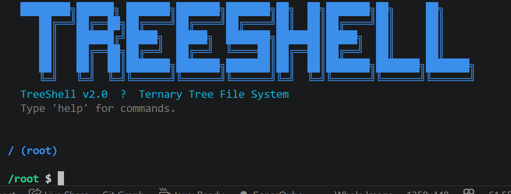

# TreeShell

## Description

TreeShell is a Java-based command-line interface that simulates an interactive file system backed by a **ternary tree data structure**. Each node in the tree represents either a directory or a file, with three typed pointers — first child, next sibling, and previous sibling — forming a true ternary structure under the hood.

The project goes beyond a basic file system simulation by supporting multi-level path navigation, file content persistence, session saving and loading, recursive removal, copy/move operations, and a color-coded terminal UI. It's designed as both a practical learning tool for data structures and a portfolio-worthy CLI application.

## Table of Contents

- [Description](#description)
- [Installation](#installation)
- [Usage](#usage)
- [Credits](#credits)
- [License](#license)
- [Badges](#badges)
- [Features](#features)
- [How to Contribute](#how-to-contribute)

## Installation

**Prerequisites:** Java Development Kit (JDK) 11 or higher.

**1. Clone the repository:**
```bash
git clone https://github.com/HassanZafar-2021/TreeShell.git
cd TreeShell
```

**2. Compile all source files:**
```bash
javac Node.java Tree.java BashTerminal.java
```

**3. Run the program:**
```bash
java BashTerminal
```

No external libraries or build tools required — pure Java, zero dependencies.

**Optional:** If you're using Visual Studio Code, install the [Extension Pack for Java](https://marketplace.visualstudio.com/items?itemName=vscjava.vscode-java-pack) and use the built-in Run button instead.

## Usage

On startup, TreeShell displays an ASCII banner and renders the current tree structure. From there, type any supported command at the prompt.

The prompt always shows your current absolute path:

```
/root/home/projects $
```

**Quick example session:**
```bash
/root $ mkdir home/projects        # create nested directories in one command
/root $ cd home/projects
/root/home/projects $ touch notes.txt
/root/home/projects $ write notes.txt My first TreeShell session
/root/home/projects $ cat notes.txt
My first TreeShell session
/root/home/projects $ save mysession
  ✔ Session saved to mysession.ttd
/root/home/projects $ exit

# Next session — restore everything exactly as you left it:
/root $ load mysession
  ✔ Loaded 3 nodes from mysession.ttd
```




## Credits

Developed by Hassan. No collaborators.

## License

This project does not currently have a license. Feel free to use and modify it as needed.

## Badges


## Features

**Ternary Tree Core**
- Every node carries exactly three typed pointers: `left` (first child), `middle` (next sibling), `right` (previous sibling) — a genuine ternary tree, not a disguised list

**Navigation**
- `pwd` — print absolute working directory path
- `cd <path>` — change directory; supports `..`, `~`, absolute paths (`/root/home`), and multi-segment paths (`a/b/c`)

**Listing & Visualization**
- `ls [path]` — list directory contents with type and file size
- `tree [path]` — render the full ternary tree with `├──` / `└──` connectors, color-coded by node type

**Creation**
- `mkdir <path>` — create a directory; automatically creates intermediate directories
- `touch <file>` — create an empty file

**File I/O**
- `write <file> <content>` — overwrite a file's content
- `append <file> <content>` — append content to a file (like `>>` redirect)
- `cat <file>` — display file content

**Metadata**
- `stat <name>` — display name, type, creation time, last modified time, and file size

**Copy / Move / Delete**
- `cp <src> <dst>` — copy a file to a new location or name
- `mv <src> <dst>` — move or rename a file or directory
- `rm [-r] <name>` — remove a file; use `-r` for non-empty directories

**Session Persistence**
- `save <filename>` — serialize the entire tree to a human-readable `.ttd` file
- `load <filename>` — reconstruct a previously saved session from a `.ttd` file

**Search & Utility**
- `find <query>` — search all nodes by name (case-insensitive, searches full tree)
- `history` — display all commands entered this session
- `clear` — clear the terminal screen
- `help` — display the full command reference

## How to Contribute

1. Fork this repository
2. Clone your fork: `git clone https://github.com/your-username/TreeShell.git`
3. Create a feature branch: `git checkout -b feature/your-feature-name`
4. Commit your changes: `git commit -m "Add your feature"`
5. Push to your branch: `git push origin feature/your-feature-name`
6. Open a pull request
